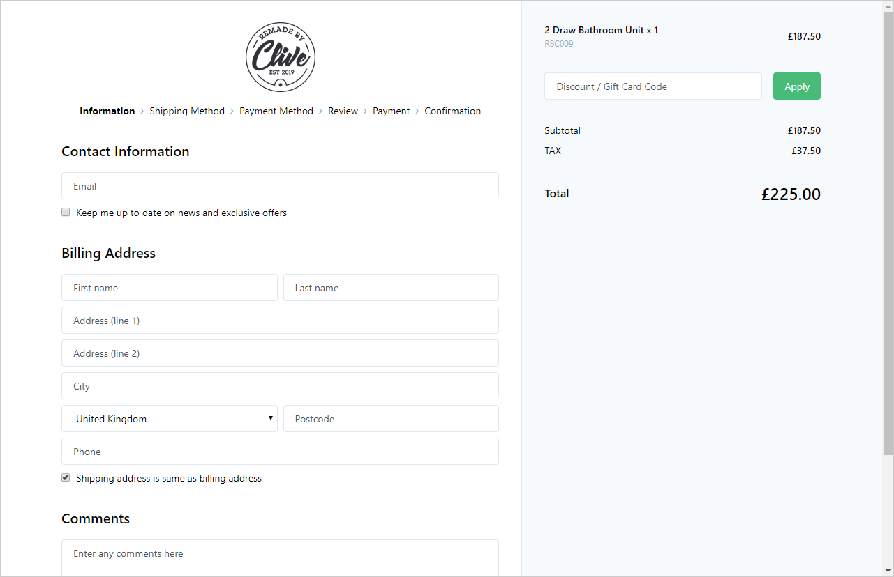

# Umbraco Commerce Checkout

A ready made checkout flow for Umbraco Commerce

## About

Umbraco Commerce Checkout is an add-on package for Umbraco Commerce, providing a drop-in checkout flow solution.

With Umbraco Commerce Checkout you can quickly and easily add a ready made, themeable and responsive checkout flow onto your site, saving hours of custom development. 

## System Requirements

To get started with the Umbraco Commerce demo store you will need:

* Visual Studio 2019 (15.9.7+)
* .NET 6.0 SDK
* Umbraco 10.0.0 
* Umbraco Commerce 10.0.0

## Raising an Issue

If you find any issues with the Umbraco Commerce Checkout add-on itself please raise them in the [issues section of this repository](https://github.com/umbraco/Umbraco.Commerce.Checkout/issues)

## License

Copyright © 2023 Umbraco

This demo store is [licensed under MIT](LICENSE.md). The core Umbraco Commerce product is licensed under Umbracos commercial license.

